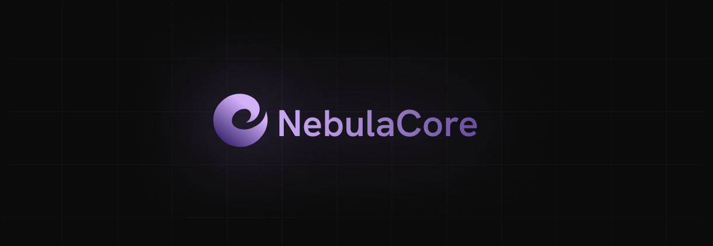

<div align="center">



# Nebula Systems Installer

**One command to stand up a full Nebula deployment.**

Provisions Nebula Core and Nebula Panel on a Linux host — dependencies, secrets,
Docker, `systemd` units, and the first administrator — then stays around to
manage what it built.

[](#project-status)
[](CHANGELOG.md)
[](#requirements)
[](#requirements)
[](LICENSE)

[Quick Start](#quick-start) · [Commands](#commands) · [What It Does](#what-it-does) · [Configuration](#configuration) · [Documentation](#documentation) · [Ecosystem](#ecosystem)

</div>

---

## Overview

Nebula ships as two independent repositories — a Python control plane and a Node
web panel — with different runtimes, different build steps, and a secret they
must agree on. Wiring that together by hand is where installations go wrong.

This installer owns that job. It locates both components wherever they live,
builds each one the way it expects to be built, generates matching `.env` files,
writes `systemd` units pointing at the right interpreter and the right working
directory, and bootstraps the first administrator over Core's internal API.

It runs on a stock Python interpreter with **zero third-party dependencies** —
it has to work before anything else is installed.

## Requirements

| Requirement | Version | Needed for |
| :--- | :--- | :--- |
| Python | 3.11+ | The installer itself |
| Linux with `systemd` | — | Service installation and management |
| `sudo` | — | Writing unit files, managing services |
| Node.js + npm | 20+ | Building Nebula Panel |
| Git | any | `fetch`, when components are not present yet |
| Docker Engine | 24+ | Container features (can be installed for you) |

## Quick Start

```bash
git clone https://github.com/elmWilh/NebulaSystemsInstaller.git
cd NebulaSystemsInstaller
chmod +x nebulactl.sh

./nebulactl.sh fetch      # clone Core and Panel if they are not here yet
./nebulactl.sh install    # guided install
```

Run `./nebulactl.sh` with no arguments for the interactive menu.

When the install finishes:

```text
Panel : http://<host>:3000
Core  : http://127.0.0.1:8000
```

### Directory layout

The installer works with any layout. It resolves each component by checking, in
order: an explicit `--core-dir` / `--panel-dir` flag, the `NEBULA_CORE_DIR` /
`NEBULA_PANEL_DIR` environment variables, its own sibling directories, the
deployment root (`/opt/nebula` by default), and finally `$HOME`.

The conventional layout is simply three checkouts side by side:

```text
/opt/nebula/
├── Nebula-Core/
├── Nebula-Panel/
└── NebulaSystemsInstaller/
```

## Commands

```text
Setup
  install            Guided install: Core + Panel + services + first admin
  fetch              Clone any missing component repositories
  create-admin       Create the first administrator account
  build-panel        Reinstall panel dependencies and rebuild the bundle
  install-services   Install or update the systemd units

Operations
  start [target]     Start services
  stop [target]      Stop services
  restart [target]   Restart services
  status             Components, host tooling, services, Core reachability
  logs [target]      Tail recent service logs
  check              Exit 0 when the deployment looks complete

  target: all (default) | core | panel
```

Everything is also available directly on `main.py` for scripted use:

```bash
python3 main.py --install --core-port 8000 --panel-port 3000
python3 main.py --service-action restart --service-target panel
python3 main.py --check && echo "deployment is complete"
```

## What It Does

<table>
<tr><th align="left">Stage</th><th align="left">Actions</th></tr>
<tr>
<td><b>Discover</b></td>
<td>Locate the Core and Panel checkouts; verify each looks like the component it claims to be</td>
</tr>
<tr>
<td><b>Core</b></td>
<td>Create <code>.venv</code>, upgrade pip, install <code>requirements.txt</code>, generate <code>.env</code> with fresh secrets</td>
</tr>
<tr>
<td><b>Panel</b></td>
<td>Generate <code>.env</code>, sync the shared internal token from Core, run <code>npm ci</code> and <code>npm run build</code></td>
</tr>
<tr>
<td><b>Docker</b></td>
<td>Detect the engine; offer to install it, start it, or fix group permissions</td>
</tr>
<tr>
<td><b>Services</b></td>
<td>Write <code>nebula-core</code> and <code>nebula-panel</code> units, enable them, and start them</td>
</tr>
<tr>
<td><b>Bootstrap</b></td>
<td>Wait for Core's health endpoint, then create the first administrator over the internal API</td>
</tr>
</table>

Every stage is idempotent. Re-running the installer tops up what is missing and
leaves existing configuration values untouched.

## Configuration

### Environment overrides

| Variable | Default | Purpose |
| :--- | :--- | :--- |
| `NEBULA_CORE_DIR` | auto-discovered | Path to the Nebula Core checkout |
| `NEBULA_PANEL_DIR` | auto-discovered | Path to the Nebula Panel checkout |
| `NEBULA_ROOT_DIR` | `/opt/nebula` | Deployment root used by `fetch` |
| `NEBULA_CORE_SERVICE` | `nebula-core` | Core `systemd` unit name |
| `NEBULA_PANEL_SERVICE` | `nebula-panel` | Panel `systemd` unit name |
| `NEBULA_CORE_SERVICE_USER` | detected | User the Core service runs as |
| `NEBULA_PANEL_SERVICE_USER` | detected | User the Panel service runs as |
| `NEBULA_LOG_LINES` | `120` | Lines returned by `logs` |
| `NEBULA_PYTHON` | `python3` | Interpreter used to run the installer |

### Generated secrets

On first run the installer generates `NEBULA_SESSION_SECRET`,
`NEBULA_INSTALLER_TOKEN`, and `NEBULA_PASSWORD_RESET_SECRET` for Core, then
copies the internal token into the Panel's `.env` so the two agree.

Existing values are never overwritten — edit either `.env` by hand and re-run
the installer as often as you like.

> `NEBULA_INSTALLER_TOKEN` bypasses session authentication on Core's internal
> endpoints. Treat it as a root credential: keep both `.env` files at mode `600`
> and never commit them.

## Module Layout

```text
main.py                 CLI, interactive menu, install orchestration
modules/
├── paths.py            Component discovery and well-known paths
├── env.py              .env generation and cross-component sync
├── components.py       Git clone, virtualenv, pip install, panel build
├── docker_setup.py     Engine detection, installation, daemon access
├── core_api.py         Health polling and first-admin bootstrap
├── core_service.py     systemd unit generation and service control
└── ui.py               Console output helpers
nebulactl.sh            Thin wrapper over main.py
```

## Documentation

Full documentation lives in [docs/](docs/):

| Document | Contents |
| :--- | :--- |
| [Install Flow](docs/INSTALL_FLOW.md) | Step-by-step walkthrough of a guided install |
| [CLI Reference](docs/CLI_REFERENCE.md) | Every flag, command, and exit code |
| [Configuration](docs/CONFIGURATION.md) | Environment overrides and generated files |
| [systemd](docs/SYSTEMD.md) | Unit anatomy, run users, log paths |
| [Architecture](docs/ARCHITECTURE.md) | Module boundaries and discovery rules |
| [Troubleshooting](docs/TROUBLESHOOTING.md) | Common failures and how to recover |
| [Development](docs/DEVELOPMENT.md) | Local setup and conventions |

## Ecosystem

| Project | Role |
| :--- | :--- |
| [Nebula Core](https://github.com/elmWilh/Nebula-Core) | Backend control plane and API |
| [Nebula Panel](https://github.com/elmWilh/Nebula-Panel) | SvelteKit web interface |
| **NebulaSystemsInstaller** *(this repository)* | Guided installer and service management |

## Project Status

The installer is **alpha**. Its command surface is stable, but it targets
pre-alpha releases of Core and Panel, so the deployment it produces is not
production-ready. Linux with `systemd` is the only supported target.

## Contributing

Issues and pull requests are welcome. Keep the zero-dependency rule intact:
anything the installer needs must come from the standard library or from a host
tool it shells out to.

## License

Copyright © 2026 Monolink Systems.

Nebula Open Source Edition (non-corporate) is licensed under the **GNU Affero
General Public License v3.0**. See [LICENSE](LICENSE) for the full text.
